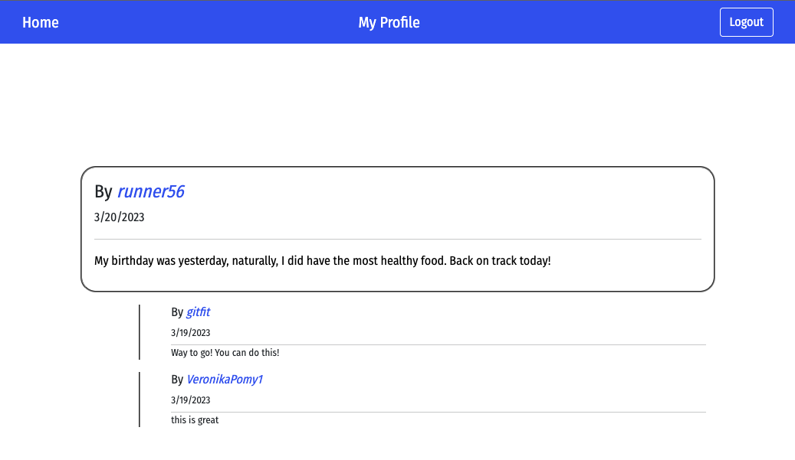
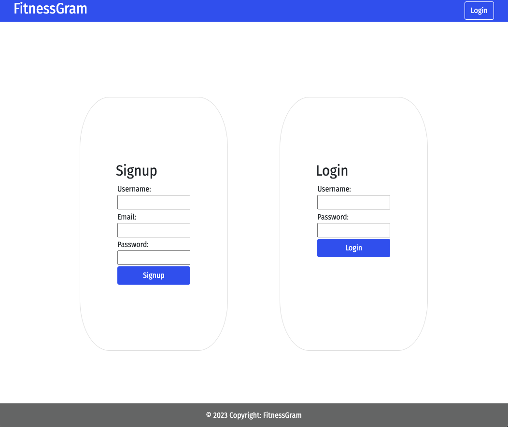

# FitnessGram

## Description

This wellness social media app helps health-conscious users track their daily habits and interact with other app users to share knowledge about exercise, healthy diet, and lifestyle.

### App functionality

---

GIVEN a wellness app that tracks our daily habits

WHEN I open the app

THEN I am prompted to log in or create an account

WHEN I am logged in, I will be brought to the homepage

THEN I can view my feed which consists of users' posts

WHEN I view other users' feeds

THEN I can interact with their posts by commenting

WHEN I click on their profile

THEN I can see their recent activity

WHEN I click on my own profile

THEN I can make posts of my own

WHEN I see a post I no longer want on my profile

THEN I can delete it

WHEN I track my activity on the app\*\* - add here

THEN I can add graphs to my profile\*\* - add here

WHEN I choose to log out

THEN I can no longer view app content and have to log back in to access it

---

## Table of Contents

  <ul>
    <li>
      <a href="#description">Description</a>
    </li>
    <li>
      <a href="#demo">Demo</a>
    </li>
    <li>
        <a href="#contributors">Contributors</a>
    </li>
    <li>
        <a href="#questions">Questions</a>
    </li>
    <li>
        <a href="#acknowledgments">Acknowledgements</a>
    </li>
  </ul>

---

## Demo

This screenshot demonstrates the view of the signup/login page.

This screenshot demonstrates the view of the homepage when a user is logged in.

---

## Contributors

**Maria Rodriguez**

**William DeShazer**

**Veronika Pomyateeva**

- Email: pomyateevav@gmail.com
- GitHub: [veronika-pomy](https://github.com/veronika-pomy?tab=repositories)

---

## Questions

If you have any questions regarding this project, please don't hesitate to contact contributors using the contact information provided in the <a href="#contributors">contributors</a> section.

---

## Acknowledgments

This list includes resources used for the project.

- [bcrypt](https://www.npmjs.com/package/bcrypt)
- [Best README Template](https://github.com/othneildrew/Best-README-Template/blob/master/README.md)
- [Bootstrap](https://getbootstrap.com/)
- [Chart.js](https://www.npmjs.com/package/chart.js?activeTab=readme)
- [Coolors](https://coolors.co/)
- [connect-session-sequelize](https://www.npmjs.com/package/connect-session-sequelize)
- [DEV: How to make footer stick at the bottom of web page](https://dev.to/nehalahmadkhan/how-to-make-footer-stick-to-bottom-of-web-page-3i14)
- [Emojipedia](https://emojipedia.org/)
- [Express](https://expressjs.com/)
- [express-session](https://www.npmjs.com/package/express-session)
- [Google Fonts - Fira Sans Condensed](https://fonts.google.com/specimen/Fira+Sans+Condensed)
- [Handlebars](https://handlebarsjs.com/)
- [Heroku](https://devcenter.heroku.com/)
- [Node.js](https://nodejs.org/en/)
- [normalize.css v8.0.1 | MIT License](https://github.com/necolas/normalize.css)
- [MySQL](https://www.mysql.com/)
- [Sequelize](https://sequelize.org/)
- [StackOverflow: Order by in nested eager loading in sequelize not working](https://stackoverflow.com/questions/40202540/order-by-in-nested-eager-loading-in-sequelize-not-working)
- [StackOverflow: Changing the space between each item in Bootstrap navbar](https://stackoverflow.com/questions/20079782/changing-the-space-between-each-item-in-bootstrap-navbar)

(<a href="#fitnessgram">BACK TO TOP</a>)
